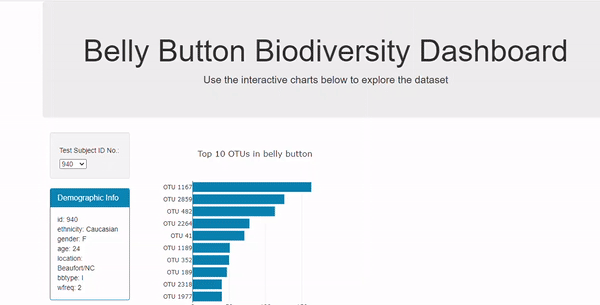

# Interactive dashboard and visualisations with Plotly # 

This interactive dashboard explores the [Belly Button Biodiversity dataset](http://robdunnlab.com/projects/belly-button-biodiversity), which catalogs the microbes that colonize human navels. The dataset reveals that a small handful of microbial species (also called operational taxonomic units, or OTUs, in the study) were present in more than 70% of people, while the rest were relatively rare.

Our interactive dashboard can be visualise here:
https://babetteblanquet.github.io/Plotly_dashboard/

The dropdown menu allows the user to select the invidual ID to visualise demographic information and microbial species of the individual.

--------------------------------------------------------------------------
## How to read our code and final presentation: ##
In this repository you will find:
- the index.html showing the interactive visualisations
- the app.js is in the folder static/js
- the data in the file samples.json

